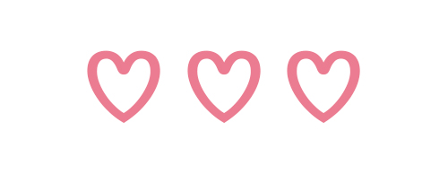

  

  
<h3>U seol</h3>

😄 Hello, the publisher of the 3nd year. 
was born on December 13, 1994. 
✨ want to make a prettier and cleaner web page ✨  

<h3>Skils</h3>

   

    

<!--
**Useol/Useol** is a ✨ _special_ ✨ repository because its `README.md` (this file) appears on your GitHub profile.

Here are some ideas to get you started:

- 🔭 I’m currently working on ...
- 🌱 I’m currently learning ...
- 👯 I’m looking to collaborate on ...
- 🤔 I’m looking for help with ...
- 💬 Ask me about ...
- 📫 How to reach me: ...
- 😄 Pronouns: ...
- ⚡ Fun fact: ...
-->
